### Question1

Insert at least 10 sample records into each of the following tables: `Customers`, `Accounts`, `Transactions`, `InterestRates`, `Branches`.

```sql
Create table Customers (
     customer_id INTEGER,
     first_name VarChar (40),
   last_name VarChar (40),
   DOB  DATE,
   email  VarChar (40),
   phone_number VarChar (40),
   address VarChar (40),
   );


Create table Accounts(

   account_id INTEGER,
   customer_id INTEGER,
   account_type VarChar(20),
   balance FLOAT,
   PRIMARY KEY  (account_id)
   );

Create table Transactions(

   transaction_id INTEGER,
   account_id  INTEGER,
   transaction_type VarChar(40),
   amount  FLOAT,
   transaction_date DATE,
   PRIMARY KEY (transaction_id),
   );


Create table InterestRates(

   interest_rate_id  INTEGER,
   account_type VarChar(40),
   interest_rate FLOAT,
   PRIMARY KEY (interest_rate_id)
   );

Create table Branches(
   branch_id INTEGER,
   branch_name VarChar(40),
   address VarChar(40),
   PRIMARY KEY (branch_id)
   );

  --Question1
  --Insert at least 10 sample records into each of the following tables: `Customers`, `Accounts`, `Transactions`, `InterestRates`, `Branches`.

 INSERT INTO Customers VALUES
    (1,'Alice', 'Johnson', '1988-09-20', 'alice.johnson@gmail.com', '9876543210', '123 Park Ave'),
    (2,'Bob', 'Williams', '1992-04-15', 'bob.williams@gmail.com', '1234567890', '456 Broadway'),
    (3,'Eva', 'Martinez', '1985-12-10', 'eva.martinez@gmail.com', '9889766754', '789 River Rd'),
    (4,'Chris', 'Garcia', '1990-07-25', 'chris.garcia@gmail.com', '4554677689', '321 Lake St'),
    (5,'Sophia', 'Brown', '1982-03-18', 'sophia.brown@gmail.com', '9812345678', '555 Hillside Ave');


INSERT INTO Customers
VALUES
    (6,'Michael', 'Davis', '1993-06-25', 'michael.davis@gmail.com', '4875567774', '147 Maple Ave'),
    (7,'Jessica', 'Robinson', '1989-11-12', 'jessica.robinson@gmail.com', '6426573833', '224 Pine St'),
    (8,'Daniel', 'Martinez', '1987-08-05', 'daniel.martinez@gmail.com', '2903874635', '769 Oak Dr'),
    (9,'Sarah', 'Gonzalez', '1995-04-30', 'sarah.gonzalez@gmail.com', '9573762337', '311 Cedar Ln'),
    (10,'Matthew', 'Lopez', '1984-01-15', 'matthew.lopez@gmail.com', '5120957402', '095 Walnut Ave');


INSERT INTO Accounts VALUES
    (101, 1, 'savings', 8000.00),
    (102, 1, 'current', 4000.00),
    (103, 2, 'savings', 6000.00),
    (104, 3, 'current', 12000.00),
    (105, 3, 'zero_balance', 0.00),
    (106, 4, 'savings', 5000.00),
    (107, 4, 'current', 1000.00),
    (108, 5, 'savings', 15000.00),
    (109, 5, 'current', 2500.00),
    (110, 5, 'zero_balance', 0.00),
    (111, 6, 'savings', 9000.00),
    (112, 6, 'current', 3000.00),
    (113, 7, 'savings', 7000.00),
    (114, 8, 'current', 11000.00),
    (115, 8, 'zero_balance', 0.00),
    (116, 9, 'savings', 8500.00),
    (117, 9, 'current', 4000.00),
    (118, 10, 'savings', 12000.00);


    INSERT INTO Transactions (transaction_id, account_id, transaction_type, amount, transaction_date)
VALUES
    (2021, 101, 'deposit', 3000.00, '2024-06-10'),
    (2022, 101, 'withdrawal', 1500.00, '2024-06-12'),
    (2023, 102, 'deposit', 2500.00, '2024-06-11'),
    (2024, 103, 'deposit', 7000.00, '2024-06-09'),
    (2025, 103, 'withdrawal', 3000.00, '2024-06-13'),
    (2026, 104, 'deposit', 2000.00, '2024-06-08'),
    (2027, 105, 'withdrawal', 750.00, '2024-06-14'),
    (2028, 106, 'transfer', 5000.00, '2024-06-07'),
    (2029, 107, 'transfer', 3000.00, '2024-06-06'),
    (2030, 108, 'withdrawal', 1500.00, '2024-06-15'),
    (2031, 109, 'deposit', 4000.00, '2024-06-05'),
    (2032, 110, 'transfer', 2000.00, '2024-06-04'),
    (2033, 111, 'deposit', 3500.00, '2024-06-03'),
    (2034, 112, 'deposit', 6000.00, '2024-06-02'),
    (2035, 113, 'transfer', 3000.00, '2024-06-01'),
    (2036, 114, 'deposit', 4500.00, '2024-05-31'),
    (2037, 115, 'withdrawal', 2000.00, '2024-05-30'),
    (2038, 116, 'transfer', 3500.00, '2024-05-29'),
    (2039, 117, 'deposit', 5000.00, '2024-05-28'),
    (2040, 118, 'withdrawal', 2500.00, '2024-05-27');


INSERT INTO InterestRates (interest_rate_id, account_type, interest_rate)
VALUES
    (1, 'savings', 0.6),
    (2, 'current', 0.2),
    (3, 'zero_balance', 0.0),
    (4, 'savings', 0.5),
    (5, 'current', 0.3),
    (6, 'savings', 0.4),
    (7, 'current', 0.25),
    (8, 'zero_balance', 0.0),
    (9, 'savings', 0.7),
    (10, 'current', 0.4);


INSERT INTO Branches (branch_id, branch_name, address)
VALUES
    (1, 'Main Branch', '123 Main Street'),
    (2, 'Downtown Branch', '456 Broadway'),
    (3, 'West Branch', '789 River Rd'),
    (4, 'West Branch', '321 Lake St'),
    (5, 'South Branch', '555 Hillside Ave'),
    (6, 'Main  Branch', '147 Maple Ave'),
    (7, 'Central Branch', '224 Pine St'),
    (8, 'Park Branch', '769 Oak Dr'),
    (9, 'West Branch', '311 Cedar Ln'),
    (10, 'Park Branch', '095 Walnut Ave');

	select * from Branches;
	select * from Customers;
	select * from Accounts;
	select * from Transactions;
	select * from InterestRates;
```

## Result 1

.png>)

.png>)

### Question2

Write a SQL query to retrieve the name, account type, and email of all customers.

```sql
select concat(first_name,' ',last_name) as fullname , account_type,email from customers
INNER JOIN Accounts
on  customers.customer_id=Accounts.customer_id;
```

## Result 2

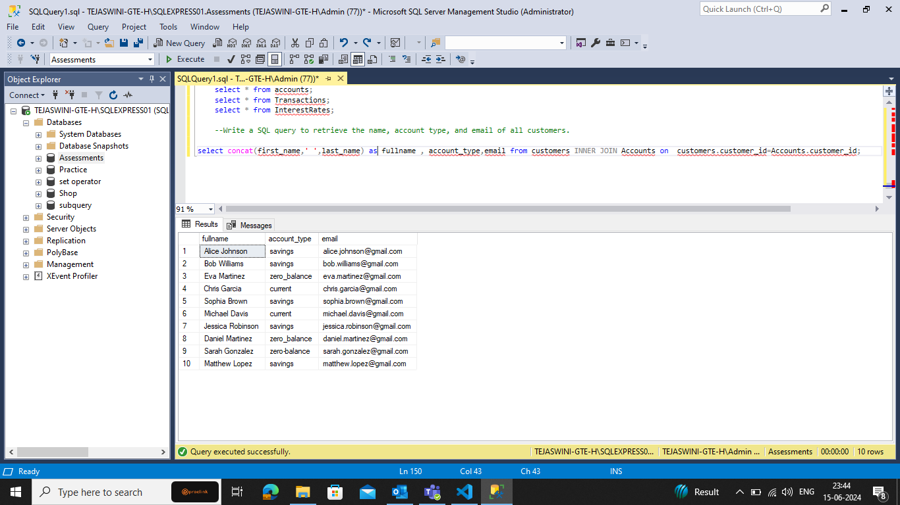

### Question3

```sql
select transaction_type , concat(first_name,' ',last_name) as fullname from  Transactions
INNER JOIN Accounts on Transactions.account_id = Accounts.account_id
INNER JOIN customers on Accounts.customer_id=customers.customer_id;

```

## Result 3

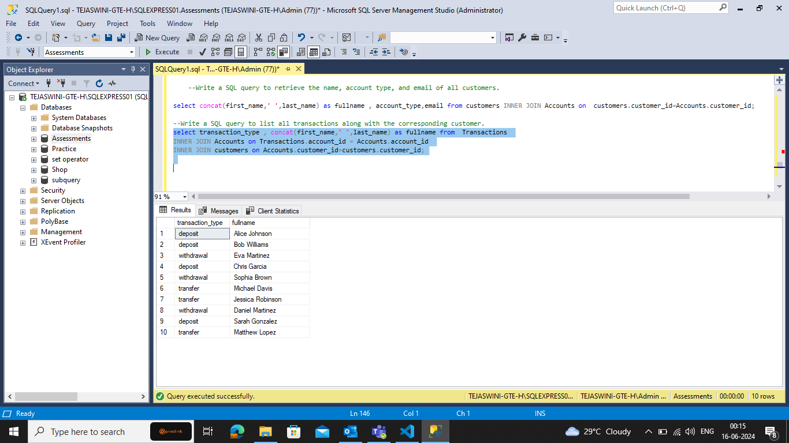

### Question4

Write a SQL query to increase the balance of a specific account by a certain amount.

```sql
Update accounts
set balance=9000
where customer_id=7;

select * from accounts;
```

## Result 4

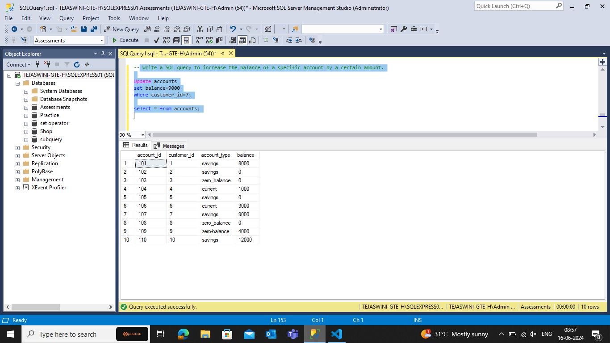

### Question5

Write a SQL query to combine the first and last names of customers as `full_name`.

```sql
select concat(first_name,'  ',last_name) as full_name from customers;
```

## Result 5

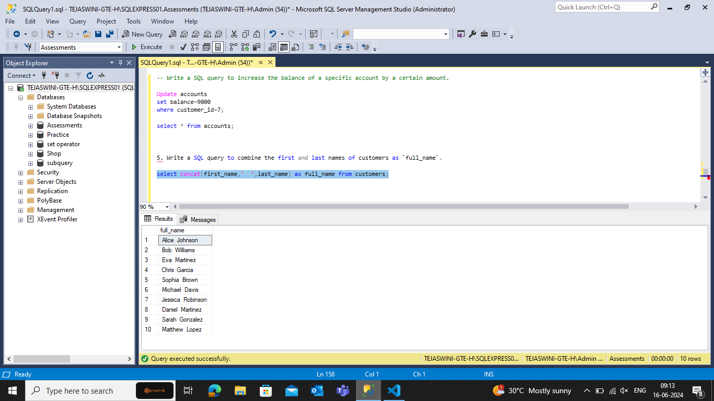

### Question6

Write a SQL query to remove accounts with a balance of zero where the account type is savings.

```sql
DELETE FROM Accounts WHERE
Acctype='savings' AND balance=0;

select * from accounts;
```

## Result 6

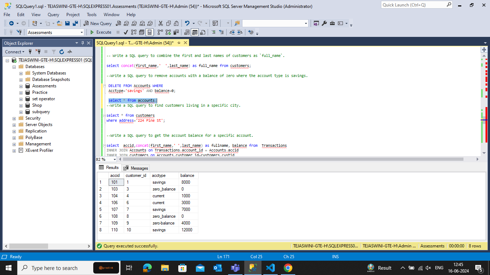

### Question7

Write a SQL query to find customers living in a specific city.

```sql
select * from customers
where address='224 Pine St';
```

## Result 7

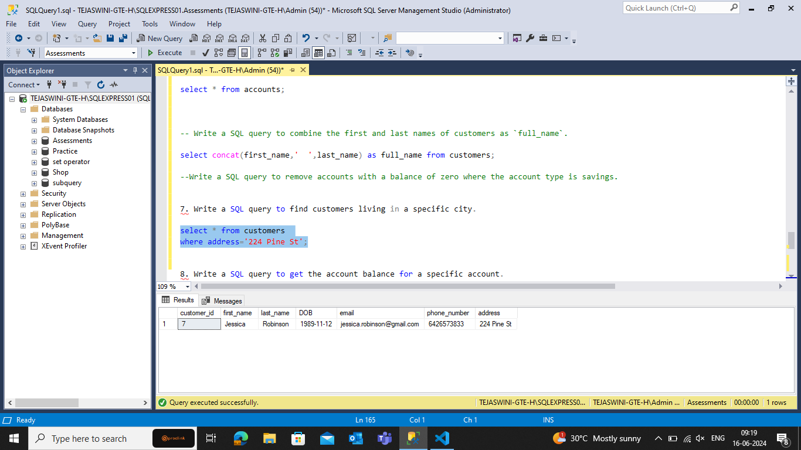

### Question8

Write a SQL query to get the account balance for a specific account.

```sql
select  accid,concat(first_name,' ',last_name) as fullname, balance from  Transactions
INNER JOIN Accounts on Transactions.account_id = Accounts.accid
INNER JOIN customers on Accounts.customer_id=customers.custid
where accid=107;

```

## Result 8

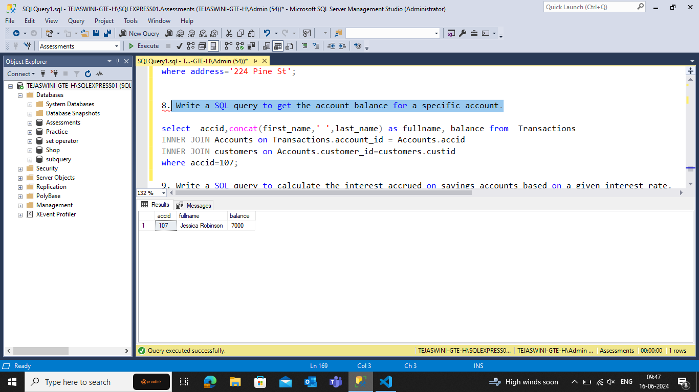

### Question9

Write a SQL query to calculate the interest accrued on savings accounts based on a given interest rate.

```sql
select balance * (interest_rate) AS interest_accrued from interestrates INNER JOIN Accounts on interestrates.interest_rate_id=accounts.customer_id
where acctype='savings';
```

## Result 9

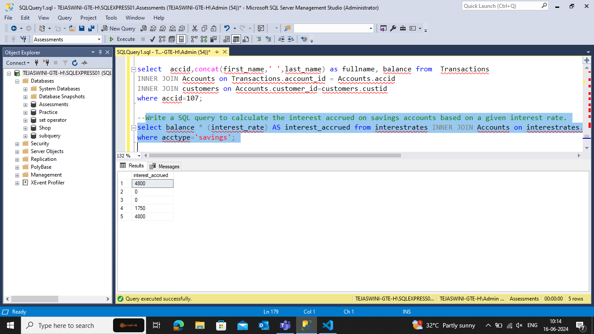

### Question10

Write a SQL query to find the average account balance for all customers.

```sql
select avg(balance) as averagebalance from accounts;
```

## Result 10

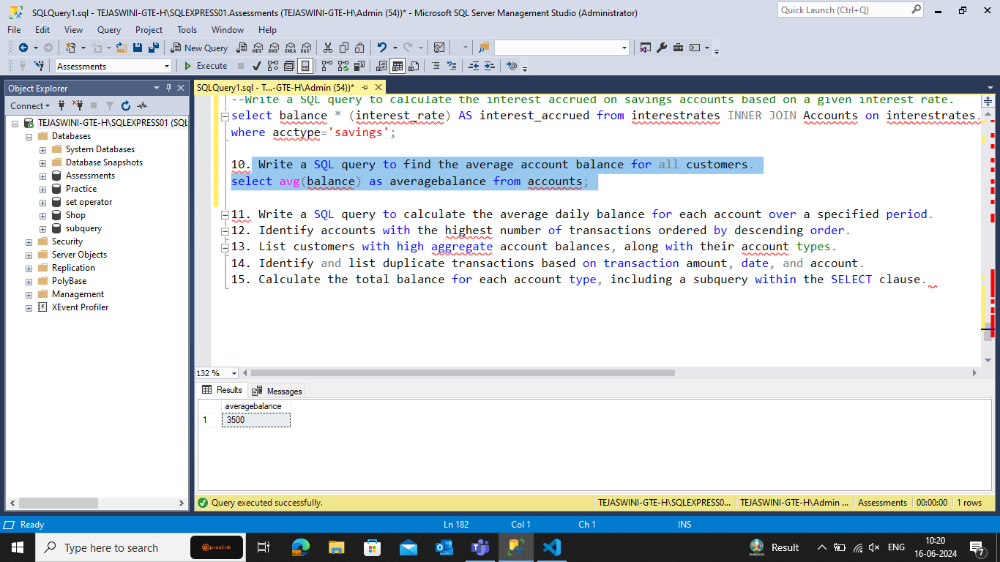

### Question11

Write a SQL query to calculate the average daily balance for each account over a specified period.

```sql
SELECT
    AVG(balance) AS daily_balance FROM accounts INNER JOIN Transactions on Accounts.accid=Transactions.account_id
WHERE
    Transaction_date BETWEEN '2024-06-10' AND '2024-06-20'
GROUP BY
    account_id;
```

## Result 11

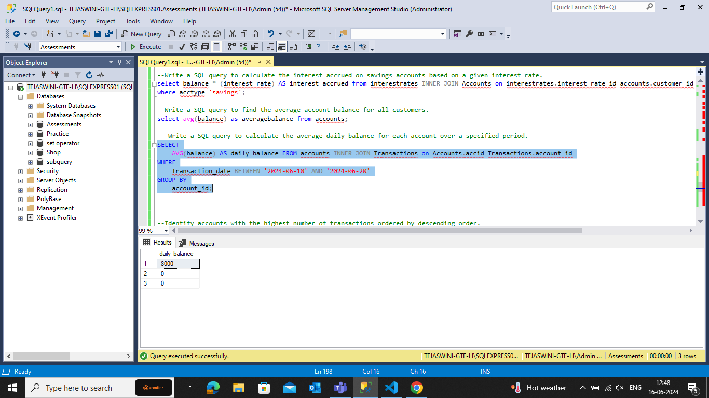

### Question12

Identify accounts with the highest number of transactions ordered by descending order.

```sql
select account_id, COUNT(*) AS num_transactions FROM transactions
GROUP BY account_id
ORDER BY num_transactions DESC;
```

## Result 12

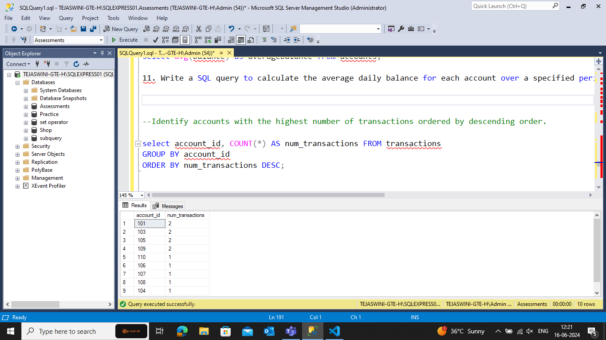

### Question13

List customers with high aggregate account balances, along with their account types.

```sql
select customer_id,sum(balance) as maximum , acctype  from Accounts INNER JOIN Transactions on Accounts.accid=Transactions.account_id
GROUP BY customer_id , acctype
order by maximum desc;
```

### Result 13

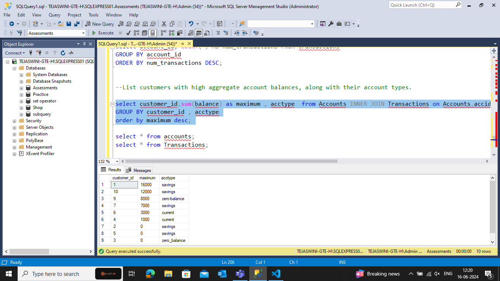

### Question14

Identify and list duplicate transactions based on transaction amount, date, and account.

```sql
SELECT transaction_date,account_id,amount,count(*) AS duplicates
FROM transactions
GROUP BY transaction_date, account_id, amount
HAVING COUNT(*) > 1;
```

## Result 14

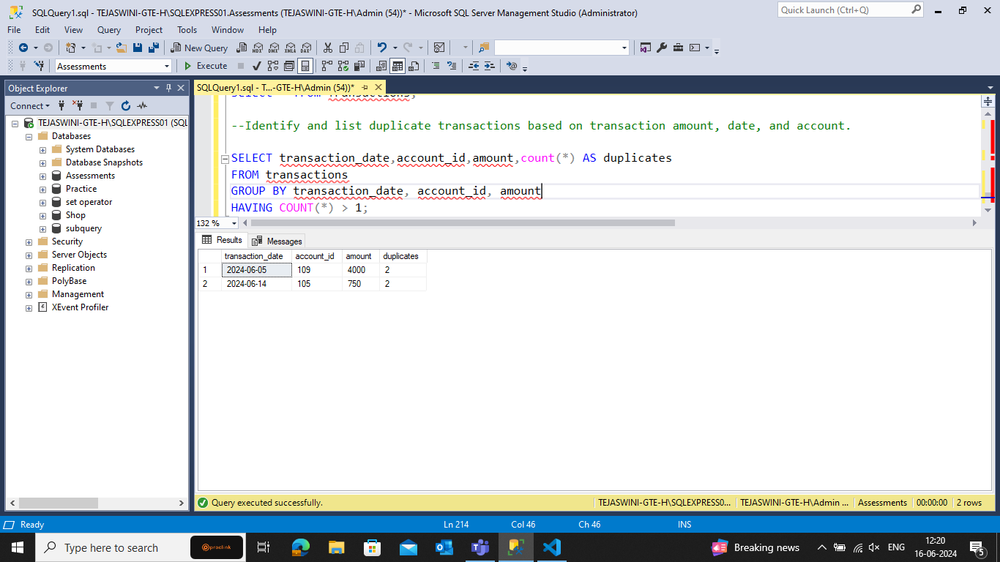

### Question15

Calculate the total balance for each account type, including a subquery within the SELECT clause.

```sql
SELECT acctype,
   (SELECT SUM(amount) FROM transactions t WHERE t.account_id = a.accid) AS total_balance
FROM accounts a
Group by Accid,Acctype
ORDER BY total_balance DESC;
```

## Result 15

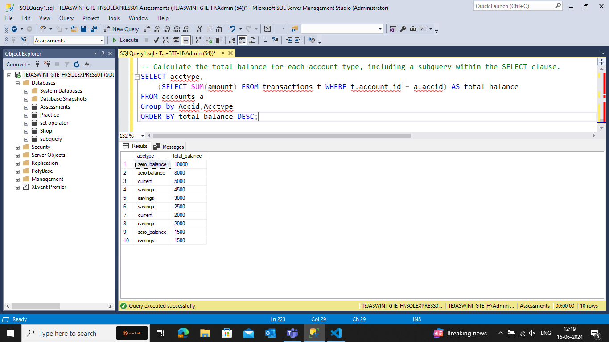
